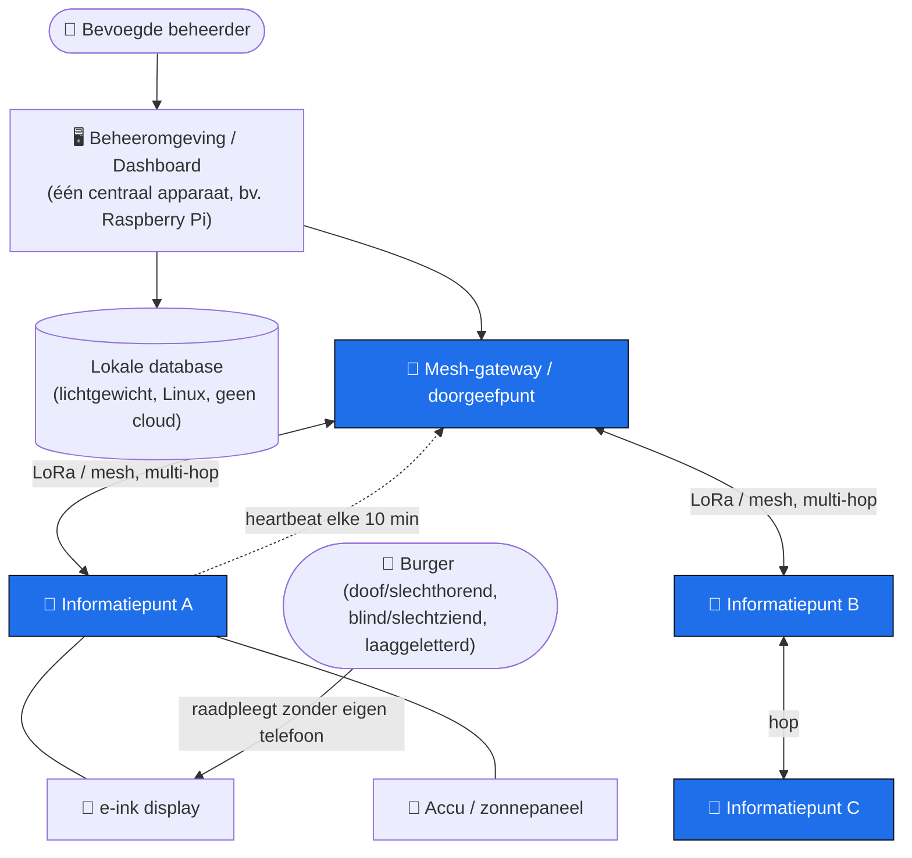
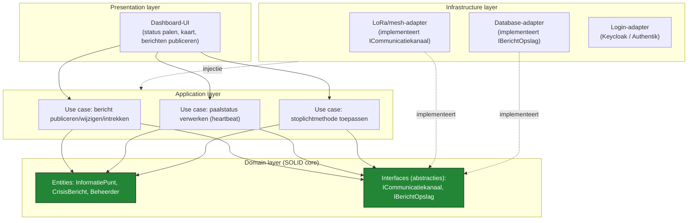
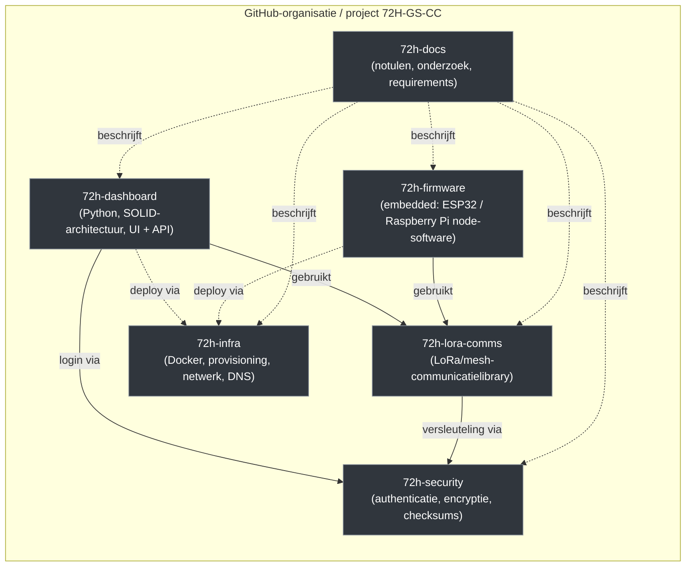
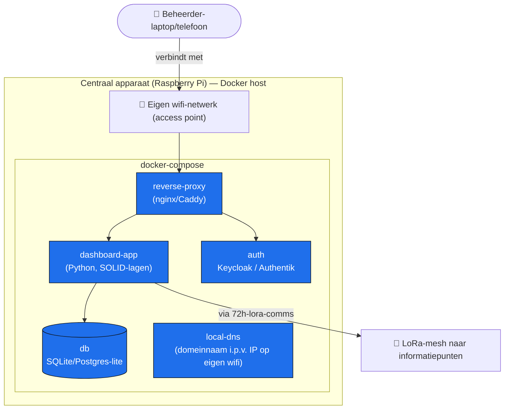
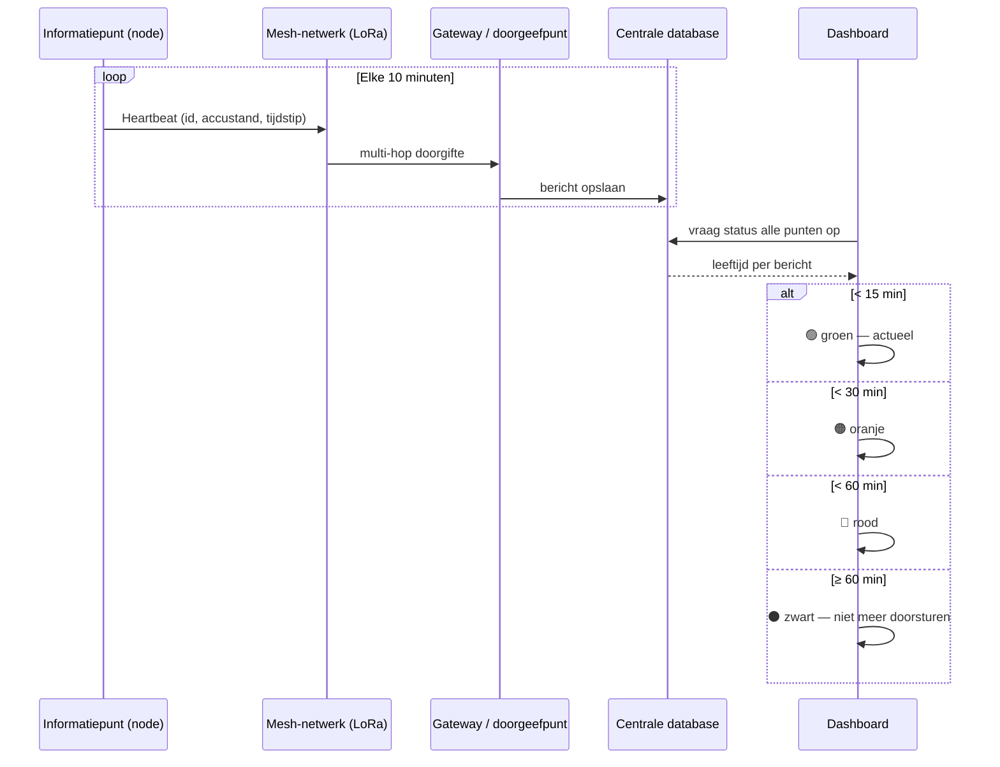

# 🔌 72 Uur Zonder Stroom — *Connected in Crisis*

Multidisciplinair Fontys-afstudeerproject (richtingen **Software, Embedded Systems, Infra/Netwerken, Cybersecurity** en **Business/UX**) dat onderzoekt hoe kwetsbare inwoners (doof/slechthorend, blind/slechtziend, laaggeletterd, anderstalig) tijdens een langdurige stroom- en netwerkuitval toch essentiële crisisinformatie kunnen blijven ontvangen.

> **Hoofdvraag:** Hoe kunnen slechthorende burgers tijdens langdurige uitval van reguliere infrastructuur toegang behouden tot essentiële informatie en communicatie?

**Opdrachtgever/stakeholder:** Martijn — Bedrijfscontinuïteitsmanagement (BCM), Veiligheidsregio Brabant-Zuidoost.

---

## 📋 Over het project

Wanneer de stroom (en daarmee GSM, internet, C2000 en P2000) langdurig uitvalt, gebeurt dat landelijk binnen circa **4 tot 6 uur**. De oplossing moet binnen **2 à 4 uur** operationeel zijn en idealiter **72 uur** zelfstandig blijven werken.

**Concept — het informatiepunt ("paal"):** een fysiek punt in de wijk met accu, eventueel zonnepaneel, een e-ink-display, een zuinig computertje (bijv. Raspberry Pi) en een low-power (LoRa-achtig) radioverbinding. Eén bevoegde beheerder publiceert vanuit één centrale beheeromgeving crisisberichten naar alle informatiepunten in het verzorgingsgebied — zonder dat ieder punt lokaal bediend moet worden.

De scope is bewust **eenrichtingsverkeer** (overheid/veiligheidsregio → inwoner); technische statusterugkoppeling (accu, bereik, laatste update) hoort al bij het dashboard, inhoudelijke burgermeldingen (zoals een SOS-knop) zijn een latere "could have".

### Kern-requirements (samenvatting, zie [`Requirements.docx`](./Requirements.docx))

| Categorie | Requirement |
|---|---|
| Tijd | Inzetbaar binnen max. 4 uur; **72 uur** autonoom functioneren bij netstroomuitval |
| Integriteit | Berichten ongewijzigd weergeven; afzender + tijdstip laatste wijziging altijd zichtbaar |
| Autorisatie | Alleen bevoegde beheerders mogen publiceren, wijzigen of intrekken |
| Beschikbaarheid | Crisisinfo blijft zichtbaar zonder verbinding; na herstart blijft data behouden |
| Transparantie | Dashboard toont expliciet of/wanneer een actualisatie is mislukt, en wanneer de laatste succesvolle update was |
| Bereik | Berichten afleverbaar bij alle punten in het verzorgingsgebied, binnen afgesproken tijd/betrouwbaarheid, verifieerbaar met een testbericht |
| Toegankelijkheid | Informatie visueel + leesbaar onder alle verwachte lichtomstandigheden; geen eigen telefoon nodig |
| Netwerk | Berichten overbrengen **zonder** openbaar internet of mobiel netwerk; uitsluitend tekst |
| Energie | Beheerder ziet wanneer energievoorziening van een onderdeel actie vereist |

Prioritering gebeurt met **MoSCoW**; de volledige requirementslijst staat in Teams en wordt uitgebreid in [`onderzoek/`](./onderzoek) en de projectnotulen.

---

## 🏗️ Systeemarchitectuur (overzicht)

**Belangrijke architectuurkeuzes:**
- **Geen centraal datacenter** — uitgangspunt is lokaal/decentraal (mesh) met kleine nodes; wel één centraal *beheer*-apparaat voor de dashboard-UI.
- **Geen cloud-afhankelijkheid** (ook geen Azure) — moet blijven werken zonder internet.
- Informatiepunten sturen periodiek een **heartbeat** (identifier, accustand, tijdstip laatste bericht); leeftijd van data wordt beoordeeld met een **stoplichtmethode** (groen <15 min, oranje <30 min, rood <60 min, zwart = niet meer doorsturen).

---

## 🧱 Software-architectuur — SOLID, gelaagd (dashboard)

Timo en Julius bouwen de dashboard-software bewust **niet** met een anemic domain model of volledige drielaagse enterprise-architectuur (te hoog gegrepen als startpunt), maar wel met heldere lagen die de **SOLID**-principes respecteren — met name *Dependency Inversion*, zodat de domeinlogica niet afhankelijk is van hardware- of databasekeuzes die nog kunnen wijzigen.

| Principe | Toepassing in dit project |
|---|---|
| **S**ingle responsibility | Een class regelt óf berichtvalidatie, óf opslag, óf transport — niet alles tegelijk |
| **O**pen/closed | Nieuwe transportlaag (bv. een ander mesh-protocol) toevoegen zonder bestaande use cases aan te passen |
| **L**iskov substitution | Elke `ICommunicatiekanaal`-implementatie (LoRa, Meshtastic, MeshCore) moet inwisselbaar zijn |
| **I**nterface segregation | Kleine, gerichte interfaces (bv. los `IBerichtOpslag` van `IStatusOpslag`) i.p.v. één grote |
| **D**ependency inversion | De domeinlaag kent alleen abstracties (`ICommunicatiekanaal`, `IBerichtOpslag`); infra-/hardwarekeuzes worden pas in de buitenste laag ingevuld |

Dit maakt het ook mogelijk dat de **netwerkkeuze (LoRa eigen mesh vs. Meshtastic vs. MeshCore)** nog open kan blijven zonder de dashboard-logica te blokkeren: de domeinlaag praat alleen met `ICommunicatiekanaal`, de daadwerkelijke implementatie wordt pas later aangesloten.

---

## 📦 Repository-structuur

Het project is (of wordt) opgesplitst in losse repo's per verantwoordelijkheid, zodat richtingen onafhankelijk kunnen bouwen en testen:

| Repo | Richting | Inhoud |
|---|---|---|
| `72h-docs` | — | Notulen, onderzoek, requirements, actiepuntenoverzicht (dit project) |
| `72h-dashboard` | Software / UX | Beheeromgeving: kaart (OpenStreetMap), paalstatus, berichten publiceren/wijzigen/intrekken, MoSCoW-functionaliteit uitgewerkt per laag (zie boven) |
| `72h-lora-comms` | Infra / Software | Herbruikbare library om met LoRa/mesh-nodes te communiceren (heartbeat, berichtformaat, stoplichtmethode); wordt zowel door dashboard als firmware gebruikt |
| `72h-firmware` | Embedded | Software die op de informatiepunt-hardware draait (ESP32/Raspberry Pi): display aansturen, sensor/accu uitlezen, heartbeat versturen |
| `72h-infra` | Infra | Docker-compose-opstelling, provisioning van Raspberry Pi's, lokale DNS/wifi-netwerk, software-/firmware-update-mechanisme |
| `72h-security` | Cybersecurity | Authenticatie (Keycloak/Authentik), versleuteling/checksums tussen palen, BIO-conformiteit |

> Binnen `72h-dashboard` wordt de Python-code opgedeeld volgens de lagen uit het SOLID-diagram hierboven (`domain/`, `application/`, `infrastructure/`, `presentation/`), zodat de dashboard-architectuur ook in de repo zelf herkenbaar blijft.

---

## 🐳 Infrastructuur & Docker

Uitgangspunt: **Linux, lichtgewicht, zonder cloud-afhankelijkheid** — bruikbaar voor zowel het softwaredeel (Timo) als het embedded/infra-deel (Floris), en inzetbaar op het centrale apparaat (bv. Raspberry Pi) dat ook zonder internet moet blijven draaien.

- **Login:** bestaande oplossing (Keycloak of Authentik) in een eigen container i.p.v. een zelfgebouwde loginpagina.
- **Bereikbaarheid bij uitval:** de Pi zendt een eigen wifi-netwerk uit; een lokale DNS-server maakt een domeinnaam bruikbaar in plaats van een IP-adres.
- **Updates:** software-/firmware-updates (normaal `git pull` + build) moeten ook werken zonder LoRa — bijvoorbeeld tijdelijk internet/mobiel netwerk op de Pi, of fysiek langsrijden.
- **Database:** lokaal en lichtgewicht (geen Azure/cloud — werkt niet bij stroomuitval); definitieve keuze (bv. SQLite vs. een kleine Postgres) wordt door Timo en Floris afgestemd.

---

## 📡 Mesh-netwerk & LoRa-communicatie

Open discussiepunt: een **eigen LoRa-mesh bouwen** versus een **bestaand open-source netwerk** (Meshtastic of MeshCore, eventueel aangepast) gebruiken — met als afweging dat de infra-studenten nog genoeg te ontwerpen moeten overhouden, en dat een mesh niet van nature is gebouwd rond één centraal punt (hoe verder van het centrale punt, hoe meer hops/latency).

**Beveiliging (cybersecurity):** berichten mogen niet ongemerkt gewijzigd worden tussen beheeromgeving en informatiepunt. Kandidaat-maatregelen: checksums per bericht, public/private-key-ondertekening per paal, en conformiteit met de BIO (Baseline Informatiebeveiliging Overheid) omdat de veiligheidsregio hieraan gebonden is.

---

## 🧰 Tech stack (werkend uitgangspunt — kan nog wijzigen)

- **Taal dashboard/software:** Python (laagdrempelig, draait op alle Linux-systemen; geschiktheid voor hardware-aansturing/Arduino nog te bevestigen samen met Embedded)
- **Architectuur:** SOLID-principes, gelaagde opbouw (domain / application / infrastructure / presentation)
- **Containers:** Docker (docker-compose) op het centrale apparaat
- **Database:** lichte, lokale database (Linux, geen cloud)
- **Login/identity:** Keycloak of Authentik
- **Kaart:** OpenStreetMap (offline bruikbaar)
- **Netwerk:** LoRa / LoRaWAN, Meshtastic en/of MeshCore (mesh, multi-hop)
- **Hardware:** Raspberry Pi (voorlopige voorkeur, nog te onderbouwen t.o.v. Banana Pi / ESP32 / Arduino / mini-pc), e-ink/e-paper-display, accu + eventueel zonnepaneel

---

## ✅ Huidige status & openstaande besluiten

- **Sprint:** project werkt volgens Scrum; sprint 3 loopt tot **26-10-2026**, bord in Mattermost.
- **Netwerkkeuze** (eigen mesh vs. Meshtastic/MeshCore) — nog niet definitief.
- **Locatie centraal dashboard-apparaat bij stroom- én internetuitval** — nog niet definitief (kandidaat: Raspberry Pi met eigen wifi + lokale DNS).
- **Hardwarekeuze** voor de informatiepunten — moet nog onderbouwd worden.
- **Database-keuze** — Timo en Floris stemmen dit af.
- Zie [`notulen/Projectcontext_samenvatting.md`](./notulen/Projectcontext_samenvatting.md) voor de volledige chronologie en [`notulen/Actiepuntenoverzicht totaal.docx`](./notulen/Actiepuntenoverzicht%20totaal.docx) voor alle actiepunten.

---

## 👥 Team

| Naam | Richting |
|---|---|
| Timo Bergthaler | Software / UX-business |
| Julius Moerdijk | Infra / Software |
| Floris Verwey | Embedded Systems / Infra |
| Jeremi Kimenai | Embedded Systems |
| Levi Nabuurs | Infra / Netwerken |
| Alexander Smeijers | Cybersecurity |

Begeleiding: coaches Lennart de Graaf en Marc Jonkers (Fontys); stakeholder Martijn (Veiligheidsregio Brabant-Zuidoost).

---

## 📂 Projectdocumentatie

- [`notulen/`](./notulen) — alle vergadernotulen + [`Projectcontext_samenvatting.md`](./notulen/Projectcontext_samenvatting.md) (glossary, chronologie, terugkerende thema's)
- [`onderzoek/`](./onderzoek) — onderzoeksdocumenten (energie, communicatie, crisisorganisatie, dashboard, peer-to-peer meldingen)
- [`Requirements.docx`](./Requirements.docx) — volledige requirementslijst
- [`studieplan/`](./studieplan) en [`reflecties/`](./reflecties) — individuele studieplannen en reflecties
